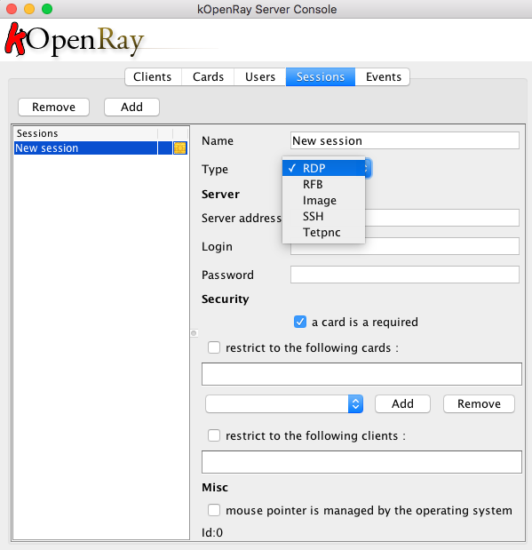

# kOpenRay

kOpenRay is a fork of _[jOpenRay](http://www.jopenray.org/)_, an open-source Java server for [SunRay 2](https://en.wikipedia.org/wiki/Sun_Ray) devices. Unfortunately, jOpenRay hasn't been updated since 2010 (though there have been [modest attempts](https://github.com/collegiumv/jopenray), some of which is in this codebase), and it has various issues with newer SunRay hardware and later JDKs. kOpenRay is a possibly intermittently potentially incompletely successful attempt to fix these problems.

Like jOpenRay, kOpenRay runs anywhere Java does (including Windows, macOS, Linux and Solaris), and is free and open-source under the GNU Public License. This version of kOpenRay is only suitable for exploratory use on a secured LAN and should not be used on a production external-facing interface.

## What does that mean?

## Alternatives
[Apache Guacamole](https://guacamole.apache.org/)

## How to build

Building requires a 1.8-compatible JDK or later, though 1.6 should still work, and Apache Ant. Just type `make` and the build is deposited in `dist/`.

## How to get your SunRays talking to it

See [README.md](assets/README.md) in [assets/](assets) (or in any release build).

## Supported Clients
1. Sun Ray 1 - ?
1. Sun Ray 2 - ?
1. Sun Ray 3 - ?
1. Software Clients - None

## [Session Types](jopenray/src/org/jopenray/server/session/Session.java)

1. RDP - untested [adapter](jopenray/src/org/jopenray/adapter/RDPAdapter.java) [src](jopenray/src/org/jopenray/rdp)
2. RFB - disabled [adapter](jopenray/src/org/jopenray/adapter/RFBAdapter.java) [src](jopenray/src/org/jopenray/rfb)
3. Image - [src](jopenray/src/org/jopenray/server/thinclient/ThinClient.java)
4. SSH - [adapter](jopenray/src/org/jopenray/adapter/SSHAdapter.java)
5. Tetpnc - [src](jopenray/src/org/jopenray/server/thinclient/ThinClient.java)

## Current version

### What's new

  - Requires Java 1.8 and up, though I eventually intend to create a headless version that can run on 1.5. The code probably still builds on 1.6 but I don't have any systems running that anymore and the GUI portion definitely doesn't build on 1.5 yet.
  - Tested on the Tadpole/General Dynamics M1400 SunRay laptop, the Accutech Gobi7 SunRay laptop and the Accutech Gobi8 SunRay laptop.

### What's better

  - Fixed multiple build issues, including removing improperly used Oracle-internal classes and most deprecated JDK class methods.
  - The keyboqrd lqyout doesn*t default to AZERTY qny?ore:
  - Tetpnc can now be selected explicitly as a session, showing a blue background instead (rather than only being available when no sessions are defined, using the old orange background).
  - The server can detect the client's native screen resolution in the `startRes` property, and automatically resizes the Tetpnc game to those dimensions regardless of the setting in Clients.
  - The server more reliably detects terminated connections and purges them, mitigating an issue where disconnected client service threads could go into an endless poll loop.
  - Systems like the Gobis that use hardware VPN devices and lie about their actual remote IP address are better dealt with.
  - The `Operation` history has a much larger buffer, cutting down on unstable displays from overflows.
  - Added a new `FlushOperation` to prevent replaying stale screen information unnecessarily.
  - NAKs and resends of screen data are much less heavyweight.
  - Various minor performance improvements.

### What's not better, and possibly worse

  - Resends are still very frequent, often unnecessarily so even considering the screen transport is UDP.
  - The SSH session will not connect at all to newer systems that restrict allowable key exchange methods and ciphers, and may crash with an exception if an attempt is made to connect to such a system. It worked fine connecting to an old Power Mac running OS X 10.4, but not my Raptor Talos II running Fedora Linux.
  - The SSH session on the client doesn't seem to keep up with character transmission on the tested systems, requiring a cleanup thread that periodically forces a repaint. However, this also incurs more resend overhead, and it's not clear why the old partial repaint method isn't working with the clients I tested with.
  - Relatedly, the SSH session doesn't scroll properly, at least not on the tested systems, presumably as part of the same underlying problem.
  - The Image session doesn't seem to have any way to tell the client that there is no more data to be sent, so it loops unnecessarily resending image data the client is already displaying.
  - Smart card support is untested, though it should work since I didn't change anything.
  - The RDP session code is untested.
  - The RFB/VNC session code isn't even enabled, though it may partially work.
  - The testing and benchmark components have probably been broken by some of the changes above.
  - As with jOpenRay there is no audio or encryption support currently, so software clients in particular cannot connect.

## License and Credits

These list all credits for various components of kOpenRay.

Copyright &copy;2019 Cameron Kaiser  
Copyright &copy;2014 Matthew Martin  
Copyright &copy;2010 jOpenRay, ILM Informatique  
Copyright &copy;2008 IsmAvatar  
Copyright &copy;2005 Propero Limited  
Copyright &copy;2003 Per Cederberg  
Copyright &copy;2002-2010 ymnk, JCraft, Inc.  
Copyright &copy;2002-2006 Constantin Kaplinsky  
Copyright &copy;2002-2005 RealVNC Ltd.  
Copyright &copy;2002 Cendio Systems  
Copyright &copy;2001-2004 HorizonLive.com  
Copyright &copy;2000 Tridia Corporation  
Copyright &copy;1999 AT&T Laboratories Cambridge  
Copyright &copy;1996 Jef Poskanzer  
Copyright &copy;1996 Widget Workshop, Inc.  
All rights reserved.

This program is free software; you can redistribute it and/or modify it under the terms of the GNU General Public License as published by the Free Software Foundation; either version 2 of the License, or (at your option) any later version.

This program is distributed in the hope that it will be useful, but WITHOUT ANY WARRANTY; without even the implied warranty of MERCHANTABILITY or FITNESS FOR A PARTICULAR PURPOSE.  See the GNU General Public License for more details.
